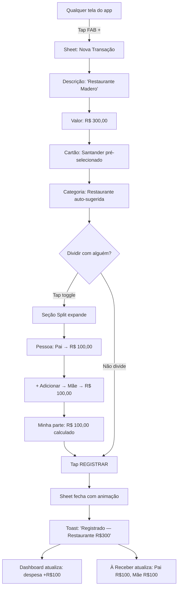
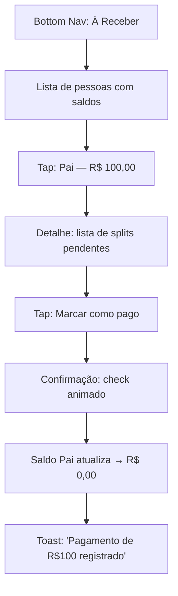
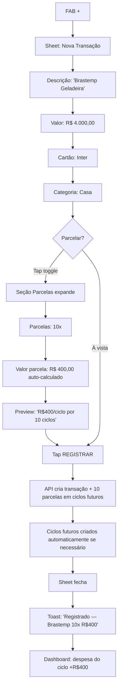
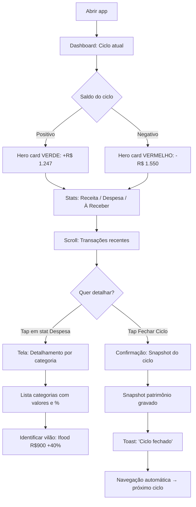
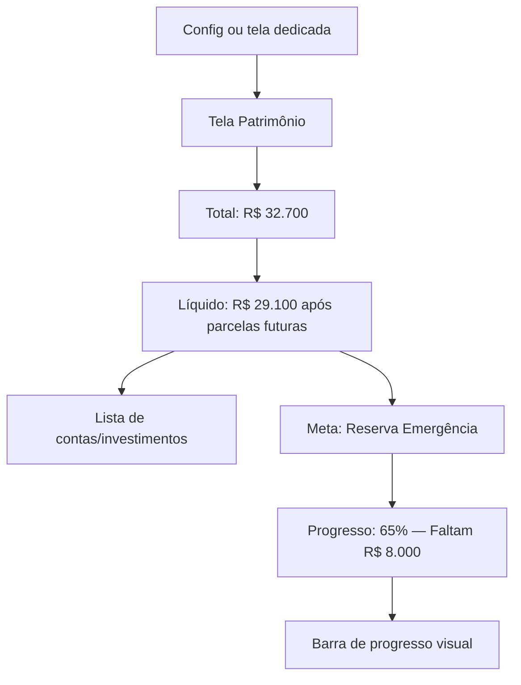

# UX Design Specification — financas

**Autor:** Bernardo
**Data:** 2026-02-24

---

## Executive Summary

### Visão do Projeto

App web de finanças pessoais, mobile-first, que substitui uma planilha Excel existente. Organiza a vida financeira em torno de **ciclos de fatura** — não meses calendário. O conceito central é que o dinheiro gasto hoje é débito no salário do mês seguinte, e o app reflete essa realidade. Destinado a um único usuário (dev PJ) que precisa de registro rápido de gastos pelo celular, controle de splits com terceiros, e visão instantânea da saúde financeira.

### Usuário-Alvo

**Bernardo — Dev PJ, único usuário**

- Precisa registrar gastos rapidamente pelo celular (pós-restaurante, compras, etc.)
- Consulta saúde financeira frequentemente — quer respostas em segundos
- Divide gastos com família (pai, mãe, namorada) e precisa saber quem deve quanto
- Gerencia renda variável (PJ), gastos fixos, impostos e parcelas
- Contexto de uso: uma mão, polegar, tela pequena, muitas vezes com pressa
- Momentos-chave: logo após um gasto, no fechamento do ciclo, consultas rápidas

### Desafios-Chave de Design

1. **Registro rápido no celular (< 30s)** — Formulário de transação é a interação mais frequente. Precisa ser fluido: poucos taps, campos inteligentes, defaults que fazem sentido. Split e parcelas acessíveis sem poluir o fluxo básico.

2. **Complexidade progressiva (progressive disclosure)** — Transação pode ser simples (café R$5) ou complexa (restaurante R$300, 3 splits, 2x parcelado). Design esconde complexidade até que seja necessária.

3. **Dashboard de comunicação instantânea** — Usuário abre o app e vê em 2 segundos: "estou no verde ou no vermelho?" Números grandes, cores claras, hierarquia visual forte, sem scroll para o essencial.

4. **Navegação intuitiva entre ciclos** — Conceito de "ciclo de fatura" não é tão intuitivo quanto "mês". Navegação precisa tornar natural: qual ciclo estou vendo, como ir para anterior/próximo.

### Oportunidades de Design

1. **"Quick add" fluido** — FAB (botão de ação flutuante) sempre visível → formulário rápido com campos mínimos. Categoria sugerida pelo nome, cartão padrão pré-selecionado.

2. **Feedback visual de saúde financeira** — Cores semafóricas (verde/amarelo/vermelho), barras de progresso, indicadores visuais que substituem a leitura atenta de números.

3. **Gestão de splits como experiência satisfatória** — "À Receber" com feedback visual ao marcar pagamentos (check, progresso), visão consolidada por pessoa.

## Core User Experience

### Experiência Definidora

A ação que define o valor do produto é **registrar um gasto pelo celular, rápido, logo após acontecer**. Se registrar um gasto for chato, lento ou trabalhoso, o app morre. Se for fluido e rápido, o app vive.

**Loop principal por frequência:**

1. **Várias vezes por dia:** Gastou → Abre o app → Registra (< 30s) → Fecha
2. **Várias vezes por semana:** Abre → Consulta dashboard → Entende a situação → Fecha
3. **Uma vez por mês:** Fecha ciclo → Analisa → Ajusta comportamento

O design reflete essa hierarquia de frequência: as ações mais frequentes são as mais acessíveis.

### Estratégia de Plataforma

- **Web SPA mobile-first** — Touch, polegar, uma mão
- **Breakpoint primário:** < 768px (celular é a interface principal)
- **Desktop:** Funcional mas não otimizado — layout wider para tabelas e dashboards
- **Offline futuro (Fase 3):** PWA, registro local + sync
- **Sem capabilities nativas** do dispositivo — é web, não native app

### Interações Sem Esforço

1. **Registrar gasto simples** — Descrição, valor, cartão. 3 campos, 3 taps + digitação. Categoria sugerida automaticamente. Pronto.
2. **Ver "estou bem ou mal?"** — Abrir app = dashboard. Cor verde/vermelha + número grande = resposta instantânea.
3. **Adicionar split** — Toggle "dividir" → aparece seção de split. Selecionar pessoa, valor. Sem sair do formulário.
4. **Marcar que alguém pagou** — Tela "À Receber" → pessoa → tap → "pago". Um gesto.
5. **Navegar entre ciclos** — Swipe lateral ou setas < > no topo do dashboard. Sempre visível em qual ciclo está.

### Momentos Críticos de Sucesso

1. **Primeiro registro:** O usuário abre, registra um gasto e pensa "isso é mais rápido que a planilha".
2. **Primeiro dashboard:** Vê o resumo do ciclo com tudo calculado — "isso é melhor que minha planilha".
3. **Primeiro split:** Registra um jantar dividido e o "À Receber" atualiza automaticamente — "nunca mais preciso anotar no WhatsApp".
4. **Fechamento do primeiro ciclo:** Snapshot gravado, números batendo, comparativo com anterior — "tenho controle real".

### Princípios de Experiência

1. **Velocidade acima de tudo** — Nenhuma interação frequente deve exigir mais de 3 taps + digitação mínima. Se o usuário hesitar, o design falhou.
2. **Mostre, não explique** — Cores, tamanhos, ícones comunicam estado financeiro. O usuário não precisa ler texto para entender se está bem ou mal.
3. **Complexidade sob demanda** — O fluxo padrão é simples. Split, parcelas, notas são expansões opcionais — visíveis mas não intrusivas.
4. **Confiança nos números** — O app precisa transmitir que os cálculos estão certos. Totais que batem, parcelas que somam, splits que conferem. Precisão = confiança.

## Resposta Emocional Desejada

### Objetivos Emocionais Primários

- **Controle** — "Eu sei exatamente onde meu dinheiro está." Não ansiedade, não obsessão — controle calmo. O app dá a sensação de que nada escapa, tudo está rastreado.
- **Alívio** — "Não preciso mais me preocupar em lembrar." O app facilita tanto que registrar vira reflexo, não esforço.
- **Clareza** — "Entendi minha situação em 2 segundos." Sem relatórios confusos. Dashboard fala a verdade de forma simples.

### Jornada Emocional

| Momento | Emoção Desejada | Emoção a Evitar |
|---------|----------------|-----------------|
| Abrir o app | Tranquilidade — "tá tudo aqui" | Ansiedade — "o que será que vou ver?" |
| Registrar gasto | Satisfação — "pronto, registrado" | Tédio — "mais um formulário chato" |
| Ver dashboard ciclo positivo | Orgulho — "mandei bem esse mês" | — |
| Ver dashboard ciclo negativo | Consciência — "sei onde ajustar" | Culpa — "sou irresponsável" |
| Fechar um split | Resolução — "resolvido, limpo" | Desconforto — "cobrança awkward" |
| Primeira vez usando | Surpresa positiva — "é mais fácil que achei" | Overwhelm — "muita coisa" |
| Retornar ao app | Hábito natural — "deixa eu registrar isso" | Obrigação — "preciso atualizar" |

### Micro-Emoções Críticas

- **Confiança > Ceticismo** — Os números precisam transmitir exatidão. Totais que batem, parcelas que somam. Se o usuário desconfiar uma vez, perde a confiança.
- **Accomplishment > Frustração** — Cada ação completada deve ter feedback positivo sutil. Toast de "Registrado", check mark, número atualizando.
- **Calma > Ansiedade** — O app informa, não julga. Ciclo negativo não é alarme — é informação clara com contexto.

### Implicações de Design

| Emoção | Decisão de Design |
|--------|------------------|
| Controle | Números sempre visíveis, nada escondido, totais que batem |
| Alívio | Formulários rápidos, defaults inteligentes, automação de parcelas |
| Clareza | Hierarquia visual forte, cores semafóricas suaves, sem jargão |
| Confiança | Precisão decimal, somas verificáveis, feedback imediato |
| Calma | Tom neutro/informativo, sem linguagem alarmista, cores suaves |
| Satisfação | Micro-feedback em cada ação (toast, animação sutil, checkmark) |

### Princípios de Design Emocional

1. **Informar, nunca julgar** — O app mostra fatos ("ciclo -R$1.550"), não opiniões ("você gastou demais"). O usuário tira suas próprias conclusões.
2. **Feedback sutil mas presente** — Cada ação tem confirmação visual. Toast discreto, número atualizando, check mark.
3. **Cores com intenção** — Verde = positivo, vermelho = negativo, mas sem alarme. Tons suaves (verde sage, vermelho muted), não cores gritantes.
4. **Primeiro uso é descoberta, não tutorial** — O app é auto-explicativo. Sem onboarding de 5 telas. O usuário abre, vê o dashboard vazio, e o CTA é "Registre seu primeiro gasto".

## UX Pattern Analysis & Inspiration

### Análise de Produtos Inspiradores

**1. Nubank — Clareza financeira mobile-first**

- **Problema que resolve bem:** Mostrar a situação financeira de forma instantânea e clara
- **O que faz bem:** Hierarquia visual forte — ao abrir, saldo/fatura em destaque, números grandes, cores claras. Timeline de transações limpa e cronológica. Navegação por abas na parte inferior
- **Padrões relevantes:** Números grandes como elemento principal, fatura como conceito central (alinhado com "ciclo"), cartões de resumo com informação condensada
- **Interações notáveis:** Scroll vertical para transações, detalhes ao tocar, busca por transações

**2. Splitwise — Gestão de splits entre pessoas**

- **Problema que resolve bem:** Dividir gastos com outras pessoas sem awkwardness
- **O que faz bem:** Visão consolidada de "quem deve quanto a quem", registro rápido de despesas divididas, agrupamento por pessoa com saldo líquido
- **Padrões relevantes:** Lista de pessoas com saldos (positivo/negativo), ação de "settle up" (marcar como pago) com um tap, resumo visual de dívidas
- **Interações notáveis:** Formulário de divisão intuitivo, seleção rápida de participantes, cálculo automático de partes

**3. Mobills/Organizze — Registro rápido de gastos**

- **Problema que resolve bem:** Registrar gastos no celular rapidamente
- **O que faz bem:** FAB (botão flutuante) sempre visível para adicionar, formulário com campos mínimos, categorias com ícones coloridos, seleção rápida de tipo (receita/despesa)
- **Padrões relevantes:** FAB como ponto de entrada principal, campos com defaults inteligentes (data=hoje, conta=padrão), categorias visuais com cor+ícone, resumo mensal no topo
- **Interações notáveis:** Toggle receita/despesa no topo do form, autocomplete de descrição, parcelamento como expansão opcional

### Padrões de UX Transferíveis

**Padrões de Navegação:**

- **Bottom navigation (3-4 tabs)** — Nubank/Mobills. Perfeito para uso com polegar, uma mão. Aplicar: Dashboard | Transações | À Receber | Config
- **Ciclo como seletor no topo** — Inspirado em seletor de mês do Nubank/fatura. Setas < > com label do ciclo, swipe lateral

**Padrões de Interação:**

- **FAB para registro rápido** — Mobills. Botão flutuante sempre acessível sobre a bottom nav. Um tap → formulário de transação
- **Formulário progressivo** — Campos básicos visíveis (descrição, valor, cartão), splits e parcelas como expansões "toggle". Inspirado em Splitwise + Mobills
- **Marcar como pago com um gesto** — Splitwise. Na tela À Receber, swipe ou tap para confirmar pagamento

**Padrões Visuais:**

- **Card de resumo financeiro** — Nubank. Card grande no topo: saldo do ciclo, cor semafórica (verde/amarelo/vermelho), valor em destaque
- **Categorias com cor + ícone** — Mobills. Identificação visual instantânea sem ler texto
- **Lista de transações cronológica** — Nubank. Agrupada por data, com categoria visual e valor alinhado à direita

### Anti-Padrões a Evitar

- **Onboarding de múltiplas telas** — Apps que forçam tutorial de 5+ telas antes de usar. O financas deve ser auto-explicativo. CTA: "Registre seu primeiro gasto"
- **Formulários com todos os campos visíveis** — Mostrar split, parcelas, notas, tags tudo de uma vez. Overwhelm. Usar progressive disclosure
- **Cores alarmistas para saldo negativo** — Vermelho gritante + ícone de alerta causa ansiedade. Usar tons suaves (vermelho muted) com tom informativo, não julgador
- **Navegação por hambúrguer menu** — Esconde funcionalidades, exige dois taps. Bottom nav é superior para mobile
- **Confirmação excessiva** — "Tem certeza que quer salvar?" para toda ação. Toast de confirmação é suficiente. Undo > Confirmação

### Estratégia de Inspiração de Design

**O que Adotar:**

- FAB como ponto de entrada para registro de gastos (Mobills) — suporta a ação mais frequente
- Bottom navigation com 3-4 tabs (Nubank) — alinhado com uso de uma mão
- Card de resumo financeiro no topo do dashboard (Nubank) — resposta instantânea "estou bem ou mal?"
- Saldo consolidado por pessoa na tela À Receber (Splitwise) — clareza na gestão de splits

**O que Adaptar:**

- Conceito de "fatura" do Nubank → "ciclo" — Seletor no topo com navegação < >, mas com datas de ciclo customizadas
- Formulário de divisão do Splitwise → Simplificar para splits fixos (valor/percentual por pessoa), sem a complexidade de grupos
- Categorias do Mobills → Menos categorias, mais focadas na realidade de dev PJ (alimentação, transporte, tech, lazer, fixos, impostos)

**O que Evitar:**

- Gamificação (badges, conquistas) — Conflita com o objetivo de controle calmo, não é um jogo
- Gráficos complexos no dashboard principal — Conflita com "resposta em 2 segundos". Gráficos ficam em tela secundária
- Social features — App pessoal, não há necessidade de comparações ou compartilhamento

## Design System Foundation

### Escolha do Design System

**shadcn/ui + TailwindCSS v4 + Radix UI primitives**

Não é uma "biblioteca de componentes" tradicional — shadcn/ui copia componentes diretamente para o projeto, dando controle total sobre o código. Combina a velocidade de um design system pronto com a flexibilidade de um sistema custom.

### Racional da Seleção

- **Velocidade de desenvolvimento** — Componentes prontos (Button, Input, Select, Dialog, Sheet, Toast, Card) que funcionam out-of-the-box. Um dev solo precisa disso
- **Controle total** — Código dos componentes vive no projeto (`/src/components/ui/`). Customização sem limitações de API de lib externa
- **Acessibilidade nativa** — Radix UI primitives garantem ARIA, keyboard navigation, focus management. Não precisa implementar do zero
- **Mobile-friendly** — Componentes como Sheet (bottom drawer), Dialog, e Popover funcionam bem em touch. TailwindCSS facilita responsive design
- **Design tokens via CSS variables** — TailwindCSS v4 usa CSS custom properties nativamente. Perfeito para tema customizado (cores semafóricas, espaçamentos touch-friendly)
- **Alinhamento com arquitetura** — Já definido no documento de arquitetura. Zero friction de decisão

### Abordagem de Implementação

**Componentes Base (shadcn/ui):**

- `Button`, `Input`, `Select`, `Label` — Formulários
- `Card` — Dashboard cards, resumo financeiro
- `Dialog` / `Sheet` — Modais e bottom drawers (mobile)
- `Toast` — Feedback de ações (Sonner)
- `Table` — Listagens (desktop)
- `Badge` — Status, categorias
- `Tabs` — Navegação secundária
- `Separator`, `Skeleton` — Layout e loading states

**Componentes Custom (a criar):**

- `CycleSelector` — Navegador de ciclos (< Ciclo Atual >) no topo
- `TransactionForm` — Formulário de registro com progressive disclosure
- `FinancialCard` — Card de resumo com cor semafórica
- `FAB` — Floating Action Button para quick-add
- `BottomNav` — Navegação inferior mobile
- `CategoryBadge` — Badge com cor + ícone por categoria
- `SplitSection` — Seção expansível de splits no form
- `PersonBalance` — Card de pessoa com saldo na tela À Receber

### Estratégia de Customização

**Design Tokens (CSS Variables):**

```css
/* Cores semafóricas suaves */
--color-positive: /* sage green (hsl ~140, 30%, 45%) */
--color-negative: /* muted red (hsl ~0, 40%, 50%) */
--color-warning: /* soft amber (hsl ~40, 60%, 50%) */
--color-neutral: /* slate gray */

/* Touch targets */
--touch-min: 44px; /* WCAG minimum */
--touch-comfortable: 48px;
--spacing-mobile: 16px; /* padding padrão */

/* Typography scale */
--text-hero: 2rem; /* número grande do dashboard */
--text-primary: 1.125rem; /* valores */
--text-secondary: 0.875rem; /* labels, metadata */
```

**Princípios de Customização:**

1. **Touch-first sizing** — Todos os elementos interativos >= 44px de área tátil
2. **Cores com significado** — Verde/vermelho/amarelo reservados exclusivamente para indicação financeira
3. **Tipografia com hierarquia** — 3 níveis claros: hero (dashboard), primary (valores), secondary (labels)
4. **Espaçamento generoso** — Mobile precisa de breathing room. Padding 16px, gaps 12px mínimo
5. **Dark mode como cortesia** — shadcn/ui suporta nativamente. Implementar no MVP se for simples, senão Phase 2

## Experiência Central Detalhada

### Experiência Definidora

**"Gastei → registro em segundos → pronto."**

Se o Tinder é "swipe para match" e o Spotify é "qualquer música instantaneamente", o financas é **"registro de gasto sem atrito"**. A interação que o usuário descreveria: "Abro, digito o valor, e tá feito. Mais rápido que anotar no WhatsApp."

É a ação que acontece **várias vezes por dia** — depois do almoço, no supermercado, pagando o Uber. Se for fluido, vira hábito. Se exigir esforço, o app é abandonado.

### Modelo Mental do Usuário

**Como resolve hoje:** Planilha Excel. Acumula gastos na cabeça ou em notas rápidas no celular, depois senta no computador e alimenta a planilha. Problema: esquece gastos, atrasa o registro, perde a confiança nos números.

**Modelo mental que traz:**

- "Gasto = descrição + valor + de onde saiu o dinheiro" (simples)
- "Às vezes divido com alguém" (expansão)
- "Às vezes parcelo" (outra expansão)
- O padrão mental é **simples primeiro, detalhe se necessário**

**Onde pode se confundir:**

- "Ciclo" vs "mês" — o conceito de ciclo de fatura não é óbvio. O seletor precisa mostrar datas claras
- "Qual cartão usar?" — Se tem vários cartões, precisa ser rápido selecionar o certo. Default resolve 80% dos casos
- "Split como funciona?" — Precisa ser intuitivo sem explicação. Toggle + campo de pessoa + valor

**O que odeia na planilha:**

- Ter que abrir computador para registrar
- Esquecer gastos e perder precisão
- Cálculos manuais de parcelas e splits
- Não ter visão instantânea da situação

**O que ama na planilha:**

- Controle total — vê tudo
- Customização — as categorias e cálculos são seus
- Confiança — ele mesmo montou, sabe que está certo

### Critérios de Sucesso

| Critério | Métrica |
|----------|---------|
| **Velocidade** | Gasto simples registrado em < 15s (descrição + valor + salvar) |
| **Mínimo de taps** | Máximo 5 taps + digitação de 2 campos para gasto simples |
| **Defaults inteligentes** | Cartão padrão pré-selecionado, data = hoje, categoria sugerida |
| **Feedback imediato** | Toast "Registrado" + número do dashboard atualiza visualmente |
| **Zero aprendizado** | Primeiro gasto registrado sem nenhuma instrução |
| **Expansão sem atrito** | Adicionar split ou parcela com 1-2 taps extras, sem sair do form |
| **Confiança** | Total do ciclo atualiza instantaneamente após registro |

### Análise de Padrões: Estabelecido com Toque Único

A experiência usa **padrões estabelecidos** que o usuário já conhece:

- **FAB** → Formulário (padrão Material Design, presente em Mobills, apps Google)
- **Formulário com campos sequenciais** (padrão universal de apps de finanças)
- **Toast de confirmação** (padrão universal mobile)
- **Bottom sheet para formulário** (padrão iOS/Android moderno)

**Toque único do financas:**

- **Progressive disclosure nativo** — Split e parcelas são expansões "toggle" dentro do mesmo formulário, não telas separadas. Isso é a diferença entre "app de finanças genérico" e "app feito para quem divide gastos"
- **Ciclo como contexto persistente** — O seletor de ciclo no topo dá contexto constante. "Estou registrando neste ciclo." Sem ambiguidade

### Mecânicas da Experiência

**1. Iniciação — O Tap**

- FAB (botão + flutuante) visível em **todas as telas**, posicionado no canto inferior direito, acima da bottom nav
- Cor de destaque (primary) — é o elemento mais chamativo da interface
- Ao tocar: abre **bottom sheet** (Sheet do shadcn/ui) com formulário de transação
- Sheet sobe com animação suave, cobre ~80% da tela, mantém contexto visual do dashboard atrás

**2. Interação — O Formulário**

```
┌─────────────────────────────┐
│ ✕                    Salvar │  ← Header com fechar e salvar
│─────────────────────────────│
│ Descrição                   │  ← Campo 1: texto livre, autofocus
│ [Almoço restaurante_____ ]  │     autocomplete de descrições anteriores
│                             │
│ Valor                       │  ← Campo 2: numérico, teclado numérico
│ [R$ 45,00________________]  │
│                             │
│ Cartão      [Nubank ▼]     │  ← Campo 3: select, default pré-selecionado
│ Categoria   [🍽 Alimentação]│  ← Auto-sugerida pelo nome, editável
│                             │
│ ▸ Dividir com alguém        │  ← Toggle colapsado (progressive disclosure)
│ ▸ Parcelar                  │  ← Toggle colapsado
│ ▸ Observação                │  ← Toggle colapsado
│                             │
│ [ ████████ REGISTRAR ████ ] │  ← Botão grande, touch-friendly
└─────────────────────────────┘
```

**Fluxo de campos:**

1. Descrição (autofocus, teclado texto) → digita → Tab/next
2. Valor (teclado numérico automático) → digita → Tab/next
3. Cartão já pré-selecionado — skip se default correto
4. Categoria auto-sugerida — skip se correta
5. Tap em "Registrar" → pronto

**Se precisar expandir (split):**

```
│ ▾ Dividir com alguém        │  ← Expandido
│   Pessoa: [Pai ▼]           │
│   Valor:  [R$ 22,50]        │
│   [+ Adicionar pessoa]      │
```

**Se precisar expandir (parcelas):**

```
│ ▾ Parcelar                   │  ← Expandido
│   Parcelas: [3x ▼]          │
│   Valor parcela: R$ 15,00   │  ← Calculado automaticamente
```

**3. Feedback — A Confirmação**

- Botão "Registrar" → loading state breve (< 500ms) → Sheet fecha com animação
- Toast aparece no topo: "Registrado — Almoço R$45,00" (2s, auto-dismiss)
- Se estava no Dashboard: card de resumo atualiza o valor com animação numérica sutil
- Se split registrado: badge "À Receber +R$22,50" atualiza

**4. Completude — O Retorno**

- Sheet fecha → usuário volta para onde estava (Dashboard ou Transações)
- Pode registrar outro imediatamente — FAB continua visível
- Ação reversível: toast tem opção "Desfazer" por 5 segundos

## Visual Design Foundation

### Sistema de Cores

**Paleta Base — Tom: Profissional-calmo, moderno, sem frivolidade**

shadcn/ui usa o sistema de cores baseado em HSL com CSS variables. A base é **slate** (cinza azulado) — mais sofisticado que cinza puro, transmite profissionalismo sem frieza.

**Cores de Interface:**

| Token | Uso | Valor (Light) |
|-------|-----|---------------|
| `--background` | Fundo geral | hsl(0, 0%, 100%) — branco |
| `--foreground` | Texto principal | hsl(222, 47%, 11%) — slate-900 |
| `--card` | Fundo de cards | hsl(0, 0%, 100%) — branco |
| `--muted` | Fundos secundários | hsl(210, 40%, 96%) — slate-100 |
| `--muted-foreground` | Texto secundário | hsl(215, 16%, 47%) — slate-500 |
| `--border` | Bordas | hsl(214, 32%, 91%) — slate-200 |
| `--primary` | Ações principais, FAB | hsl(221, 83%, 53%) — blue-600 |
| `--primary-foreground` | Texto sobre primary | hsl(0, 0%, 100%) — branco |

**Cores Semafóricas (financeiras):**

| Token | Uso | Valor | Tom |
|-------|-----|-------|-----|
| `--financial-positive` | Saldo positivo, receitas | hsl(142, 35%, 42%) | Sage green — calmo, não eufórico |
| `--financial-negative` | Saldo negativo, despesas | hsl(0, 45%, 52%) | Muted red — informativo, não alarmista |
| `--financial-warning` | Atenção, próximo do limite | hsl(38, 65%, 50%) | Soft amber — alerta suave |
| `--financial-neutral` | Valores neutros, zerados | hsl(215, 16%, 47%) | Slate — sem carga emocional |

**Princípios de cor:**

1. Cores semafóricas **exclusivas para significado financeiro** — nunca decorativas
2. Blue como cor primária de ação (FAB, links, CTAs) — neutro financeiramente
3. Contraste mínimo 4.5:1 em texto sobre fundo (WCAG AA)
4. Dark mode: inverter backgrounds, manter semáforo reconhecível

### Sistema Tipográfico

**Fonte: Inter** — A typeface padrão do shadcn/ui. Sans-serif, otimizada para telas, excelente legibilidade em tamanhos pequenos, suporte a números tabulares (alinhamento de valores monetários).

**Escala Tipográfica:**

| Nível | Tamanho | Peso | Uso |
|-------|---------|------|-----|
| Hero | 2rem (32px) | Bold (700) | Número principal do dashboard (saldo do ciclo) |
| H1 | 1.5rem (24px) | Semibold (600) | Títulos de seção |
| H2 | 1.25rem (20px) | Semibold (600) | Sub-títulos, nomes de cards |
| Body Large | 1.125rem (18px) | Medium (500) | Valores monetários em listas |
| Body | 1rem (16px) | Regular (400) | Texto geral, descrições |
| Small | 0.875rem (14px) | Regular (400) | Labels, metadata, datas |
| XSmall | 0.75rem (12px) | Medium (500) | Badges, tags, texto auxiliar |

**Números tabulares:** Inter suporta `font-variant-numeric: tabular-nums` — todos os números com mesma largura. Crítico para alinhamento de valores em listas de transações.

**Line heights:**

- Headings: 1.2 (tight)
- Body: 1.5 (comfortable)
- Small: 1.4 (compact)

### Spacing & Layout Foundation

**Base unit: 4px** — Todos os espaçamentos são múltiplos de 4px.

**Escala de espaçamento:**

| Token | Valor | Uso |
|-------|-------|-----|
| `--space-1` | 4px | Gaps mínimos (entre ícone e texto) |
| `--space-2` | 8px | Padding interno de badges, gaps em listas compactas |
| `--space-3` | 12px | Gap entre itens de lista |
| `--space-4` | 16px | Padding padrão de cards e containers mobile |
| `--space-5` | 20px | Gap entre seções dentro de uma tela |
| `--space-6` | 24px | Gap entre cards no dashboard |
| `--space-8` | 32px | Margin entre seções principais |

**Layout Mobile (< 768px):**

- Padding horizontal da tela: 16px
- Cards: full-width com padding 16px
- Bottom nav: height 56px (com safe area)
- FAB: 56px diâmetro, 16px do canto inferior direito, acima da bottom nav
- Touch targets mínimos: 44x44px
- Formulário: campos full-width, stack vertical

**Layout Desktop (>= 768px):**

- Container max-width: 640px (centrado) para fluxos de entrada
- Dashboard: grid 2 colunas para cards de resumo
- Tabelas de transações: largura total com colunas fixas
- Sem bottom nav — sidebar ou top nav
- FAB mantido mas reposicionado

**Grid:**

- Mobile: coluna única, stack vertical
- Desktop: CSS Grid, max 2 colunas para dashboard cards, 1 coluna para formulários e listas

### Considerações de Acessibilidade

- **Contraste:** WCAG AA mínimo (4.5:1 texto normal, 3:1 texto grande). Cores semafóricas testadas contra fundo branco e dark mode
- **Touch targets:** Mínimo 44x44px para todos os elementos interativos (WCAG 2.5.5)
- **Foco visível:** Outline de 2px na cor primary para navegação por teclado (shadcn/ui inclui por padrão)
- **Números tabulares:** Alinhamento de valores para leitura rápida de listas financeiras
- **Redução de movimento:** Respeitar `prefers-reduced-motion` — desabilitar animações de transição
- **Cor não é único indicador:** Saldo positivo/negativo sempre acompanha sinal (+ ou -) além da cor

## Design Direction Decision

### Direções Exploradas

Três direções foram geradas e avaliadas através de mockups interativos (`ux-design-directions.html`):

- **A — Clean & Minimal:** Fundo branco, cards sutis, tom bancário-confiável. Mais próximo do shadcn/ui default
- **B — Bold & Dark:** Dark mode nativo, cores vibrantes sobre fundo escuro, tipografia bold, barra de progresso visual
- **C — Warm & Approachable:** Tons quentes (stone), inputs underline, À Receber com avatares, tom pessoal-acolhedor

### Direção Escolhida

**B — Bold & Dark**

Dark mode como modo primário. Fundo `#0f172a` (slate-900), cards em `#1e293b` (slate-800), cores semafóricas vibrantes sobre fundo escuro (green `#6ee7a0`, red `#fca5a5`, amber `#fcd34d`). FAB com gradient. Tipografia bold e impactante. Barra de progresso visual no dashboard.

### Racional do Design

- **Impacto visual** — Números financeiros se destacam mais sobre fundo escuro. O saldo do ciclo em 44px bold sobre dark é impossível de ignorar
- **Modernidade** — Estética tech/moderna alinhada com o perfil do usuário (dev PJ). Não parece "app de banco do pai"
- **Conforto visual** — Uso frequente (várias vezes por dia), especialmente à noite. Dark mode reduz fadiga ocular
- **Economia de bateria** — Em telas OLED (maioria dos smartphones modernos), dark mode consome menos energia
- **Cores semafóricas vibrantes** — Sobre fundo escuro, verde e vermelho comunicam com mais intensidade sem parecer alarmistas. O contraste é naturalmente suave
- **Diferenciação** — Light mode é o padrão de qualquer app. Dark mode dá identidade própria ao financas

### Abordagem de Implementação

**Design Tokens Dark (primário):**

| Token | Valor |
|-------|-------|
| `--background` | hsl(222, 47%, 11%) — #0f172a |
| `--foreground` | hsl(210, 40%, 98%) — #f1f5f9 |
| `--card` | hsl(217, 33%, 17%) — #1e293b |
| `--muted` | hsl(217, 33%, 17%) — #1e293b |
| `--muted-foreground` | hsl(215, 20%, 65%) — #94a3b8 |
| `--border` | hsl(217, 19%, 27%) — #334155 |
| `--primary` | gradient(135deg, #6ee7a0, #3b82f6) |
| `--financial-positive` | #6ee7a0 (vibrante sobre dark) |
| `--financial-negative` | #fca5a5 (vibrante sobre dark) |
| `--financial-warning` | #fcd34d (vibrante sobre dark) |

**Componentes adaptados:**

- FAB: circular com gradient green→blue, shadow com glow
- Cards de transação: background card (#1e293b) com rounded-12px, sem borda
- Stats: 3 colunas iguais, centralizado, tipografia bold
- Seletor de ciclo: chip centralizado com setas laterais
- Bottom nav: background card, ícone ativo em green
- Inputs: filled dark com border sutil (#334155), rounded-12px

**Light mode como alternativa:**

- shadcn/ui suporta toggle dark/light nativamente
- Implementar toggle em Config, mas dark como default
- Tokens light do Step 8 ficam como fallback

## User Journey Flows

### Jornada 1: Registrar Compra com Split

**Contexto:** Restaurante R$300, dividido com pai e mãe. Pagou no Santander.



**Detalhes de interação:**

- **Entrada:** FAB → Sheet bottom (80% da tela)
- **Autofill:** Descrição "Restaurante" → categoria auto-sugerida "Restaurante"
- **Split toggle:** Expande in-place. Selecionar pessoa de dropdown (pessoas cadastradas). Valor sugerido = total / (n pessoas + 1)
- **Cálculo:** "Minha parte" atualiza em tempo real conforme adiciona pessoas
- **Feedback:** Toast + dashboard atualiza saldo do ciclo (apenas minha parte) + badge À Receber atualiza
- **Tempo estimado:** ~25s (com split)

**Resolução do split (sub-jornada):**



### Jornada 2: Compra Parcelada

**Contexto:** Geladeira R$4.000 em 10x no Inter.



**Detalhes de interação:**

- **Parcelas toggle:** Expande com campo numérico (2x a 24x). Valor da parcela calcula automaticamente
- **Preview inline:** Mostra "R$400/ciclo por 10 ciclos, início Fev/26" — clareza antes de confirmar
- **Backend:** Cria ciclos futuros automaticamente para alocar parcelas (conforme decisão arquitetural)
- **Nas transações futuras:** Aparece "Brastemp Geladeira (3/10)" com badge indicando parcela
- **Tempo estimado:** ~20s

### Jornada 3: Fechar Ciclo e Analisar

**Contexto:** Dia do fechamento. Entender como foi o ciclo.



**Detalhes de interação:**

- **Dashboard é a home:** Ao abrir = dashboard do ciclo atual. Resposta em 2 segundos
- **Hero card:** Número grande (44px bold), cor semafórica (green/red), barra de progresso receita vs despesa
- **Stats row:** 3 blocos — Receita (green), Despesa (red), À Receber (amber)
- **Detalhamento:** Tap em qualquer stat → drill-down com categorias, valores e comparativo com ciclo anterior
- **Fechar ciclo:** Ação mensal. Botão no final do dashboard. Confirmação simples. Grava snapshot de patrimônio

### Jornada 4: Patrimônio e Investimentos (Phase 2)

**Contexto:** Recebeu extra, quer decidir onde investir.



**Nota:** Esta jornada é Phase 2. O fluxo detalhado será refinado quando a fase for implementada.

### Padrões de Jornada

**Padrões de Navegação:**

- **FAB como ponto de entrada universal** — Presente em todas as telas. Sempre leva ao formulário de transação
- **Bottom nav para contexto** — 4 tabs: Dashboard | Transações | À Receber | Config
- **Drill-down por tap** — Dashboard → detalhe de categoria → transações filtradas

**Padrões de Decisão:**

- **Progressive disclosure** — Campos opcionais (split, parcelas, nota) colapsados por padrão. Um tap para expandir
- **Defaults inteligentes** — Cartão padrão, data=hoje, categoria sugerida. Reduz decisões a zero para gasto simples
- **Confirmação mínima** — Sem "tem certeza?". Toast com "Desfazer" por 5s é suficiente

**Padrões de Feedback:**

- **Toast para ações** — "Registrado", "Pago", "Ciclo fechado". Auto-dismiss 2-3s. Com opção Desfazer quando reversível
- **Atualização visual imediata** — Dashboard recalcula no retorno. Números animam sutilmente
- **Cores semafóricas** — Green para positivo, red para negativo. Consistente em todas as telas

### Princípios de Otimização de Fluxo

1. **Happy path sem bifurcação** — Gasto simples = reta. Sem decisões intermediárias. Split e parcelas são desvios opcionais
2. **Feedback before navigation** — Toast aparece antes de navegar. O usuário vê a confirmação sem perder contexto
3. **Undo over confirm** — Desfazer é melhor que confirmar. Menos atrito, mais velocidade, mesmo nível de segurança
4. **Context preservation** — Sheet (não page navigation) para formulário. O usuário não "sai" da tela, apenas abre uma camada

## Component Strategy

### Componentes do Design System (shadcn/ui)

| Componente | Uso no financas | Jornada |
|-----------|-----------------|---------|
| `Button` | Registrar, Fechar Ciclo, ações gerais | Todas |
| `Input` | Descrição, valor | J1, J2 |
| `Select` | Cartão, categoria, pessoa, parcelas | J1, J2 |
| `Sheet` | Formulário de transação (bottom sheet) | J1, J2 |
| `Card` | Dashboard cards, stats, resumos | J3 |
| `Badge` | Categorias, status de parcela (3/10), status split | J1, J2, J3 |
| `Toast` (Sonner) | Feedback de ações: "Registrado", "Pago" | Todas |
| `Dialog` | Confirmação de fechar ciclo, deletar | J3 |
| `Skeleton` | Loading states de dashboard e listas | Todas |
| `Separator` | Divisores em cards e listas | Todas |
| `Collapsible` | Progressive disclosure: split, parcelas, nota | J1, J2 |
| `Tabs` | Navegação secundária (ex: filtros) | J3 |
| `ScrollArea` | Listas longas de transações | J3 |
| `Table` | Listagem de transações desktop | J3 |

### Componentes Custom

**1. BottomNav**

- **Propósito:** Navegação principal mobile (4 tabs)
- **Conteúdo:** Dashboard | Transações | À Receber | Config
- **Estados:** default, active (ícone + label em green `#6ee7a0`), com badge de notificação
- **Anatomia:** Container `#1e293b`, height 56px, 4 items com ícone (20px) + label (10px), safe area padding
- **Acessibilidade:** `role="navigation"`, `aria-current="page"` no ativo, suporte a keyboard tab
- **Responsivo:** Visível < 768px. Desktop: substituído por sidebar ou top nav

**2. FAB (Floating Action Button)**

- **Propósito:** Ponto de entrada para registro rápido de transação
- **Conteúdo:** Ícone "+" centralizado
- **Estados:** default (gradient green→blue), pressed (scale 0.95), disabled (opacity 0.5)
- **Anatomia:** 56px circular, gradient `#6ee7a0 → #3b82f6`, shadow com glow, position fixed, bottom-right acima da BottomNav
- **Ação:** Tap → abre Sheet com TransactionForm
- **Acessibilidade:** `aria-label="Registrar nova transação"`, focusável, Enter/Space ativa

**3. CycleSelector**

- **Propósito:** Navegar entre ciclos de fatura
- **Conteúdo:** Chip com datas do ciclo ("25/Jan — 24/Fev") + setas < >
- **Estados:** default, loading (skeleton no label), disabled (setas em ciclos limites)
- **Anatomia:** Container centralizado, chip `#1e293b` com border `#334155` rounded-20px, setas laterais 18px
- **Ação:** Tap setas → carrega ciclo anterior/próximo
- **Acessibilidade:** `aria-label="Ciclo atual: 25 Jan a 24 Fev"`, setas com `aria-label="Ciclo anterior"/"Próximo ciclo"`

**4. FinancialHeroCard**

- **Propósito:** Exibir saldo do ciclo como informação principal do dashboard
- **Conteúdo:** Label "Saldo do Ciclo", valor grande, barra de progresso
- **Estados:** positive (valor em `#6ee7a0`), negative (valor em `#fca5a5`), loading (skeleton)
- **Anatomia:** Centralizado, valor em 44px bold, barra de progresso 6px com gradient, label 13px `#64748b`
- **Variantes:** Com/sem barra de progresso, com/sem subtítulo

**5. StatsRow**

- **Propósito:** Resumo de 3 métricas financeiras (Receita, Despesa, À Receber)
- **Conteúdo:** 3 colunas iguais, cada uma com valor + label
- **Estados:** default, loading (skeleton)
- **Anatomia:** Grid 3 colunas, cards `#1e293b` rounded-14px, padding 14px, valor 18px bold, label 11px
- **Cores:** Receita `#6ee7a0`, Despesa `#fca5a5`, À Receber `#fcd34d`

**6. TransactionItem**

- **Propósito:** Linha de transação em lista
- **Conteúdo:** Ícone categoria, nome, metadata (cartão + categoria), valor
- **Estados:** default, pressed (background lighten), com badge de parcela, com badge de split
- **Anatomia:** Card row `#1e293b` rounded-12px, padding 14px, ícone 40px rounded-12px com background translúcido, valor alinhado à direita
- **Variantes:** Simples, com badge parcela ("3/10"), com indicador de split

**7. TransactionForm**

- **Propósito:** Formulário de registro de transação dentro do Sheet
- **Conteúdo:** Descrição, valor, cartão, categoria + colapsáveis (split, parcelas, nota)
- **Estados:** empty, filling, submitting, error
- **Anatomia:** Stack vertical, inputs filled dark `#1e293b` border `#334155` rounded-12px, valor 28px bold centralizado, toggles com Collapsible
- **Composição:** Usa `Input`, `Select`, `Collapsible`, `Button` do shadcn/ui internamente

**8. SplitSection**

- **Propósito:** Seção expansível para dividir transação com pessoas
- **Conteúdo:** Lista de splits (pessoa + valor) + "Minha parte" calculado + botão adicionar
- **Estados:** collapsed, expanded, com items
- **Anatomia:** Dentro de Collapsible. Cada split: Select pessoa + Input valor. "Minha parte" calculado em real-time
- **Validação:** Soma dos splits não pode exceder valor total

**9. PersonBalanceCard**

- **Propósito:** Card de pessoa com saldo na tela À Receber
- **Conteúdo:** Avatar (inicial + cor), nome, saldo total pendente
- **Estados:** default, com pendências, zerado (tudo pago)
- **Anatomia:** Row com avatar 40px circular, nome 14px, valor 15px bold green, tap → detalhe
- **Ação:** Tap → lista de splits pendentes da pessoa

**10. InstallmentBadge**

- **Propósito:** Indicar parcela em transação
- **Conteúdo:** "3/10" ou "Parcela 3 de 10"
- **Estados:** default, última parcela (destaque)
- **Anatomia:** Badge compacto, background translúcido, text 11px

### Estratégia de Implementação de Componentes

**Princípios:**

1. **shadcn/ui primeiro** — Sempre usar componente base se existir. Custom só para necessidades específicas do financas
2. **Composição** — Componentes custom são compostos de componentes base (TransactionForm usa Input, Select, Collapsible, Button)
3. **Tokens consistentes** — Todos os custom usam os mesmos CSS variables do tema dark
4. **Mobile-first** — Componentes desenhados para touch. Desktop é adaptação (não o contrário)

### Roadmap de Implementação

**MVP — Componentes Críticos:**

- `BottomNav` — Navegação (tela 1)
- `FAB` — Entrada para registro (tela 1)
- `TransactionForm` + `SplitSection` — Core da Jornada 1 e 2
- `FinancialHeroCard` + `StatsRow` — Dashboard (Jornada 3)
- `CycleSelector` — Navegação entre ciclos
- `TransactionItem` + `InstallmentBadge` — Lista de transações
- `PersonBalanceCard` — Tela À Receber

**Phase 2 — Enriquecimento:**

- `CategoryChart` — Gráfico de pizza por categoria (detalhamento)
- `CycleComparison` — Comparativo entre ciclos
- `PatrimonyCard` — Card de conta/investimento (Jornada 4)
- `GoalProgress` — Barra de progresso de meta

## UX Consistency Patterns

### Hierarquia de Botões

| Nível | Estilo | Uso | Exemplo |
|-------|--------|-----|---------|
| **Primary** | Gradient green→blue, full-width, 16px padding, bold | Ação principal de uma tela/form | "Registrar", "Fechar Ciclo" |
| **Secondary** | Border `#334155`, transparent bg, text `#e2e8f0` | Ação secundária | "Cancelar", "Ver todas" |
| **Ghost** | Sem border, sem bg, text `#94a3b8` | Ação terciária / link | "Desfazer", "Pular" |
| **Destructive** | Background `#fca5a5` com opacity 15%, text `#fca5a5` | Ação destrutiva | "Excluir transação" |
| **Icon** | Ícone sem texto, 44x44px touch area | Ações compactas | Setas do CycleSelector, fechar Sheet |

**Regras:**

- Máximo **1 botão primary** por tela/form visível
- Botão primary sempre no final (bottom) do form — thumb-friendly
- Destructive sempre requer confirmação via Dialog

### Padrões de Feedback

**Toast (Sonner):**

| Tipo | Cor | Duração | Uso |
|------|-----|---------|-----|
| Sucesso | Green `#6ee7a0` accent | 2s auto-dismiss | "Registrado", "Pago", "Ciclo fechado" |
| Sucesso reversível | Green + botão "Desfazer" | 5s | "Registrado — Almoço R$45" [Desfazer] |
| Erro | Red `#fca5a5` accent | Persist até dismiss | "Erro ao salvar. Tente novamente." |
| Info | Blue `#60a5fa` accent | 3s auto-dismiss | "Ciclo anterior carregado" |

**Regras:**

- Toast sempre no **topo** da tela (não conflita com BottomNav/FAB)
- Sucesso: auto-dismiss. Erro: persist (usuário precisa ler)
- Máximo 1 toast visível por vez (fila, não stack)

### Padrões de Formulário

**Inputs (dark filled):**

- Background: `#1e293b`, border: `#334155`, rounded-12px
- Focus: border muda para `#6ee7a0` (green), glow sutil
- Erro: border muda para `#fca5a5` (red), mensagem abaixo em 12px red
- Disabled: opacity 0.5

**Validação:**

| Quando | Comportamento |
|--------|--------------|
| **Blur** | Valida campo individual (formato, obrigatoriedade) |
| **Submit** | Valida todos. Scroll para primeiro erro. Focus no campo |
| **Real-time** | Apenas para cálculos (split total, valor parcela) — não para erros |

**Campos monetários:**

- Input type="text" com máscara (não type="number" — problemas mobile)
- Formato: `R$ 1.234,56` — ponto milhar, vírgula decimal
- Teclado numérico via `inputMode="decimal"`
- Valor armazenado em centavos (inteiro) no state

**Progressive disclosure:**

- Collapsible fechado por padrão: texto em `#475569` + seta ▸
- Collapsible aberto: seta ▾ + conteúdo com animação slide-down (150ms)
- Sem indicador de "obrigatório" nos colapsáveis — sempre opcionais

### Padrões de Navegação

**Bottom Nav (mobile):**

- 4 tabs sempre visíveis: Dashboard | Transações | À Receber | Config
- Ativo: ícone + label em `#6ee7a0`, peso bold
- Inativo: ícone + label em `#475569`
- Tap → navegação instantânea (sem animação de transição entre páginas)
- Mantém scroll position ao voltar para uma tab

**Navegação entre ciclos:**

- CycleSelector persistente no topo de Dashboard e Transações
- Setas < > para navegar
- Loading state: skeleton no label enquanto carrega dados do ciclo

**Navegação de profundidade:**

- Drill-down (Dashboard → Detalhe categoria): push com back arrow no header
- Sheet (FAB → Formulário): overlay bottom, swipe down ou tap X para fechar
- Dialog (Confirmar fechar ciclo): overlay centralizado, tap fora ou botão para fechar

### Padrões de Empty State

| Tela | Empty State |
|------|------------|
| Dashboard (primeiro uso) | Ilustração sutil + "Registre seu primeiro gasto" + FAB pulsando |
| Transações (ciclo vazio) | "Nenhuma transação neste ciclo" + botão "Registrar" |
| À Receber (sem splits) | "Nenhum valor a receber" + texto "Divida um gasto para ver aqui" |
| Lista filtrada sem resultados | "Nenhum resultado para este filtro" + botão "Limpar filtros" |

**Regras:**

- Sempre oferecer **ação** no empty state (não só texto)
- Tom neutro/informativo, nunca negativo
- Sem ilustrações pesadas — ícone sutil + texto + CTA

### Padrões de Loading

| Situação | Padrão |
|----------|--------|
| Carregamento de tela | Skeleton nos slots de conteúdo |
| Ação do usuário (submit) | Botão: disabled + spinner inline. Duração < 500ms ideal |
| Navegação entre ciclos | Skeleton no FinancialHeroCard + StatsRow + lista |
| Pull-to-refresh | Spinner circular no topo (futuro PWA) |

**Regras:**

- Skeleton > spinner para carregamento de tela (menos disruptivo)
- Spinner inline no botão > spinner fullscreen para ações
- Optimistic update quando possível (toast antes da confirmação do server, rollback se falhar)

### Padrões de Erro

| Tipo | Tratamento |
|------|-----------|
| Erro de validação | Inline no campo, border red, mensagem abaixo |
| Erro de rede | Toast persistente: "Sem conexão. Tente novamente." + botão retry |
| Erro de servidor (500) | Toast persistente: "Erro inesperado. Tente novamente." |
| Erro de auth (401) | Redirect automático para login |
| Erro de conflito (409) | Dialog explicativo com opções |

**Regras:**

- Mensagens em português, claras, sem códigos técnicos
- Sempre oferecer ação de recuperação (retry, voltar, tentar novamente)
- Nunca perder dados do formulário em caso de erro — preservar state

## Responsive Design & Accessibility

### Estratégia Responsiva

**Mobile-first — celular é a interface principal.**

O financas é usado primariamente no celular, com uma mão, pós-gasto. Desktop é funcional mas secundário.

1. Projetar para mobile (< 768px) primeiro
2. Adaptar para desktop (>= 768px) com media queries
3. Tablet herda layout mobile (touch, vertical) — não justifica breakpoint próprio

**Adaptações por dispositivo:**

| Aspecto | Mobile (< 768px) | Desktop (>= 768px) |
|---------|-------------------|---------------------|
| Navegação | BottomNav (4 tabs) + FAB | Sidebar esquerda + FAB reposicionado |
| Dashboard | Stack vertical, cards full-width | Grid 2 colunas para stats, sidebar para transações |
| Formulário | Sheet bottom (80% tela) | Dialog centralizado (max-width 480px) |
| Transações | Lista vertical, cards full-width | Table com colunas (data, descrição, categoria, cartão, valor) |
| À Receber | Lista vertical de pessoas | Grid 2 colunas + detalhe ao lado |
| CycleSelector | Topo fixo, centralizado | Topo fixo, alinhado à esquerda da área de conteúdo |
| Touch targets | 44px mínimo | Pode reduzir para 32px (mouse) |

### Estratégia de Breakpoints

**Dois breakpoints — simplicidade:**

| Breakpoint | Valor | Comportamento |
|-----------|-------|---------------|
| **Mobile** | < 768px | Layout primário. BottomNav, stack vertical, Sheet para forms |
| **Desktop** | >= 768px | Sidebar, grid, Table, Dialog para forms |

**Implementação TailwindCSS v4:**

- Mobile: estilos default (sem prefix)
- Desktop: prefix `md:` para override
- Sem breakpoint tablet — herda mobile
- Container: mobile full-width com padding 16px, desktop max-width 1024px centralizado

### Estratégia de Acessibilidade

**Nível: WCAG 2.1 AA**

**Perceivable (Perceptível):**

- Contraste 4.5:1 texto normal, 3:1 texto grande. Testar cores semafóricas sobre `#0f172a` e `#1e293b`
- Texto escalável até 200% sem perda de funcionalidade (`rem` units)
- Cor nunca como único indicador: saldo positivo/negativo sempre acompanha sinal (+/-)
- `alt` text em ícones informativos. Ícones decorativos: `aria-hidden="true"`

**Operable (Operável):**

- Todos os elementos interativos acessíveis por teclado (Tab, Enter, Space, Escape)
- Focus visível: outline 2px `#6ee7a0` em todos os focusáveis
- Touch targets mínimo 44x44px (mobile)
- Skip link "Ir para conteúdo" no início da página

**Understandable (Compreensível):**

- `lang="pt-BR"` no HTML
- Labels em todos os inputs (`<label>` ou `aria-label`)
- Mensagens de erro claras, em português, associadas ao campo (`aria-describedby`)
- Navegação consistente (BottomNav sempre nas mesmas posições)

**Robust (Robusto):**

- HTML semântico: `<nav>`, `<main>`, `<header>`, `<section>`
- ARIA roles onde semântica nativa não é suficiente
- Compatível com screen readers: VoiceOver (iOS/Mac), TalkBack (Android)

### Estratégia de Testes

**Testes Automatizados:**

- `eslint-plugin-jsx-a11y` — Lint de acessibilidade em JSX no build
- `axe-core` via Playwright — Testes E2E de acessibilidade
- Lighthouse CI — Score de acessibilidade no pipeline

**Testes Manuais (periódicos):**

- Navegação completa por teclado
- VoiceOver no iPhone — fluxo de registro de transação
- Zoom 200% no browser — layout não quebra
- Teste real em smartphone Android e iPhone

### Guidelines de Implementação

**CSS/TailwindCSS:**

- Usar `rem` para font-size, nunca `px`
- `min-height: 44px` e `min-width: 44px` em todos os interativos mobile
- `@media (prefers-reduced-motion: reduce)` — desabilitar animações
- `font-variant-numeric: tabular-nums` em todos os valores monetários

**HTML/React:**

- Componentes shadcn/ui já incluem ARIA por padrão (Radix UI)
- Formulários: sempre `<label htmlFor>` ou `aria-label`
- Modais (Sheet/Dialog): focus trap automático (Radix UI inclui)
- BottomNav custom: `<nav role="navigation" aria-label="Menu principal">`
